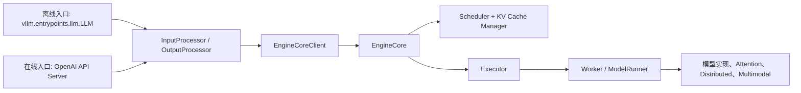

# vLLM 中文源码导读

这组文档面向“第一次系统阅读 vLLM 源码的人”。

它不试图替代官方使用文档，而是回答三个更偏工程实现的问题：

1. vLLM 的主入口在哪里？
2. 一次请求在代码里是怎么流动的？
3. 读源码时应该先抓哪些模块，后看哪些细节？

## 一句话理解 vLLM

vLLM 是一个面向大模型推理与服务的运行时系统。它的核心目标不是“训练模型”，而是“把模型高效、稳定、低成本地跑起来”，因此代码重心集中在以下几类问题：

- 请求如何持续批处理与调度。
- KV Cache 如何管理、复用与扩展。
- 模型如何在单卡、多卡、多进程、甚至多机环境下执行。
- 如何把离线推理、OpenAI 兼容服务、多模态、LoRA、结构化输出等能力统一到同一套运行时里。

## 当前版本的关键判断

阅读这个仓库时，最重要的事实是：`vllm.engine.llm_engine.LLMEngine` 与 `vllm.engine.async_llm_engine.AsyncLLMEngine` 已经是对 `vllm.v1` 实现的别名封装。也就是说，当前应把 `v1` 看作主线实现，而不是旁支实验目录。

因此，理解 vLLM 可以先建立下面这张心智模型：

## 文档组成

- [请求主链路](request-flow.md)：先看离线推理和在线服务分别怎么走。
- [V1 核心架构](v1-core.md)：解释 `InputProcessor`、`EngineCore`、`Scheduler`、`Executor`、`Worker` 的职责边界。
- [模块地图](module-map.md)：把 `vllm/` 顶层目录按功能分区整理出来。
- [建议阅读顺序](reading-order.md)：给出一条更省力的源码阅读路径。

## 先给结论

如果你只想先抓住主线，可以先记住四句话：

1. `entrypoints` 负责暴露给用户的 API 与服务入口。
2. `v1/engine` 负责把输入变成内部请求、驱动内核循环、再把结果整理回用户可见输出。
3. `v1/core/sched` 是性能与行为语义最关键的地方，它决定每一步给谁分多少 token 预算。
4. `executor` 与 `worker` 把“调度决策”变成“真正的模型执行”，并向下衔接设备、并行与内核实现。
