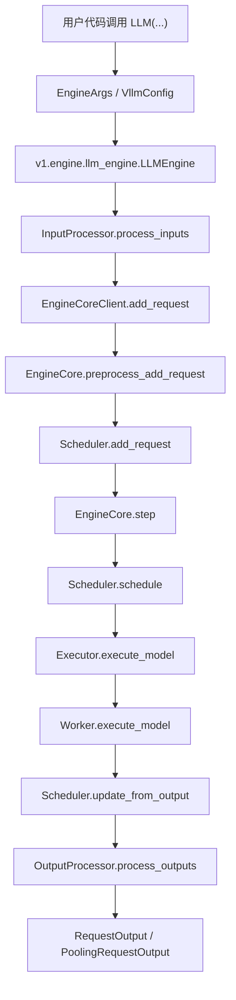
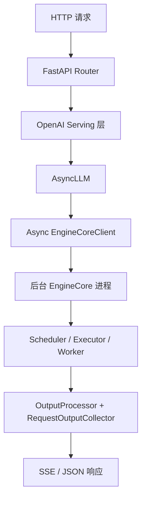

# vLLM 请求主链路

这一篇只追踪“请求是怎么走的”，不展开所有优化细节。

## 1. 离线推理链路

最常见的离线入口是 `vllm.entrypoints.llm.LLM`。

它的职责可以概括为三步：

1. 接收用户参数，整理为 `EngineArgs` / `VllmConfig`。
2. 创建 `v1` 版本的 `LLMEngine`。
3. 在 `generate()`、`embed()`、`score()` 等调用里，把用户输入送入引擎并收集结果。

从代码结构上看，这一条链路大致是：

这里最值得注意的点有两个：

- `InputProcessor` 负责把外部输入统一成 `EngineCoreRequest`，包括文本、多模态、LoRA、采样参数、池化参数等。
- `OutputProcessor` 负责把内部增量输出重新组织成用户看到的 `RequestOutput`，同时处理 detokenize、logprobs、流式输出聚合等逻辑。

## 2. 在线服务链路

在线服务通常从 `vllm.entrypoints.openai.api_server` 进入。

它的工作重点不是执行模型本身，而是把 HTTP 层和引擎层接起来：

1. 解析 CLI 参数并创建 `AsyncEngineArgs`。
2. 构建 `FastAPI` 应用与各类 router。
3. 创建 `AsyncLLM` 引擎客户端。
4. 在请求到来时调用异步 `add_request()`，并把流式结果回传给客户端。

可以把它理解为：

在线与离线的差异主要在外围，而不在内核：

- 离线接口更像一个同步库调用。
- 在线接口多了一层 HTTP 协议、路由注册、异常处理与流式返回。
- 但进入 `v1` 核心后，二者共享同一套调度、执行和输出处理主干。

## 3. 输入在进入引擎前做了什么

`InputProcessor` 是理解“外部 API 如何落到内部语义”最关键的桥。

它主要做这些事：

- 校验 `SamplingParams` 或 `PoolingParams` 是否与当前模型能力匹配。
- 处理 LoRA 请求是否合法。
- 调用 `InputPreprocessor` 把 prompt、token ids、embeds、多模态输入规范化。
- 为多模态请求整理特征、位置、哈希与缓存标识。
- 生成 `EngineCoreRequest`，供后续调度与执行使用。

还有一个容易忽略但很重要的细节：`assign_request_id()` 会把外部请求 ID 随机化扩展成内部请求 ID，以减少重复 ID 带来的冲突风险，同时保留 `external_req_id` 供对外输出使用。

## 4. 一次 step 中实际发生了什么

`EngineCore.step()` 是运行时的中心循环。它的骨架非常清楚：

1. 调用 `scheduler.schedule()` 产出本轮调度结果。
2. 调用 `model_executor.execute_model()` 触发模型执行。
3. 如果需要，再调用 `sample_tokens()` 完成采样。
4. 调用 `scheduler.update_from_output()` 把模型输出写回请求状态、KV Cache 与统计信息。
5. 把结果交给 `OutputProcessor`，最终形成用户可见输出。

这也是 vLLM 阅读时最应该反复对照的一条主线，因为很多复杂功能本质上都是在这个闭环里插入额外状态：

- prefix caching
- chunked prefill
- structured outputs
- speculative decoding
- multimodal encoder cache
- LoRA
- 分布式并行

## 5. 这条链路里的职责边界

为了避免读源码时混淆，建议按下面的分层理解：

- `entrypoints`：面向用户接口。
- `engine`：面向请求生命周期。
- `core/sched`：面向调度与缓存状态机。
- `executor`：面向进程/节点级执行编排。
- `worker`：面向设备上的真实前向与采样。

一旦分层清楚，后面再看性能优化和功能扩展就会容易很多。
